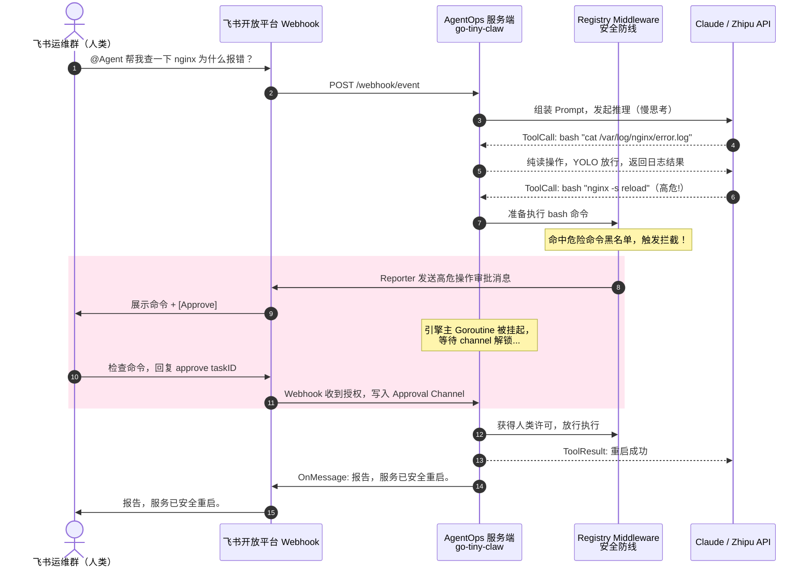
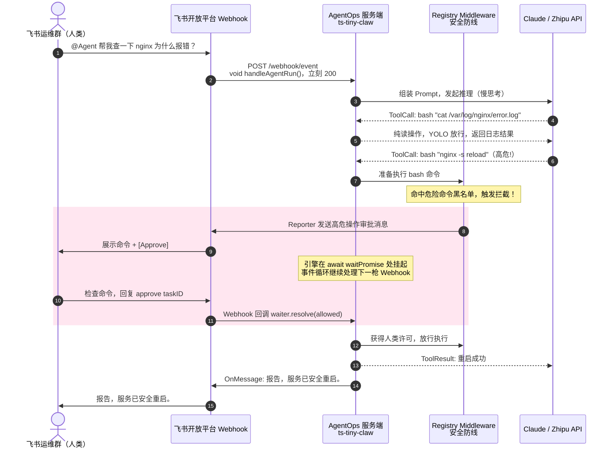

# 安全与通信：Human-in-the-Loop 时序图

专栏原图（Go）与 Node 对照。对外 15 步交互相同；内部挂起原语从 **Goroutine + channel** 换成 **async + Promise**。

在支持 Mermaid 的预览里打开本文件即可渲染；源图也可单独用 `.mmd` 导入 [mermaid.live](https://mermaid.live)。

---

## 1. Go（go-tiny-claw）

对应原图：引擎主 Goroutine 在 `<-ch` 上挂起，Webhook 协程写入 Approval Channel 后唤醒。

---

## 2. Node（ts-tiny-claw）

业务箭头不变。Webhook 回调里 `void handleAgentRun()` 立刻 200；引擎在 `await waitPromise` 处把控制权交还事件循环；审批回调 `waiter.resolve()` 唤醒同一条 async 调用栈。

---

## 对照要点

| 时序位置 | Go | Node |
|---|---|---|
| 第 2 步：收消息 | `go handleAgentRun(...)` | `void this.handleAgentRun(...)` |
| 粉色框内：挂起 | `result := <-ch` | `await waitPromise` |
| 第 12 步：唤醒 | `ch <- ApprovalResult{...}` | `waiter.resolve({ allowed, reason })` |
| 实现位置 | Goroutine + `chan` | `internal/feishu/approval.ts` 的 `Map<taskID, resolve>` |
